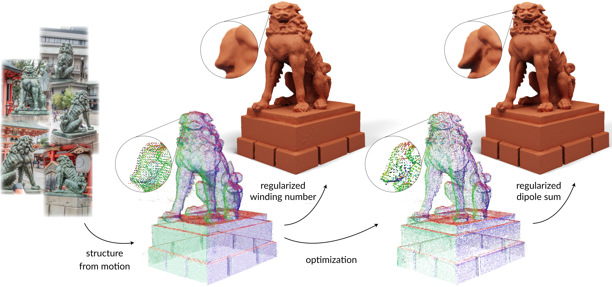

# 3D reconstruction with fast dipole sums
## [Project website](https://imaging.cs.cmu.edu/fast_dipole_sums/)

<p align="center">
  
</p>

We introduce a method for high-quality 3D reconstruction from multi-view images. Our method uses a new point-based representation, the regularized dipole sum, which generalizes the winding number to allow for interpolation of per-point attributes in point clouds. We additionally derive Barnes-Hut fast summation schemes for accelerated dipole sum queries that facilitate the use of ray tracing to efficiently and differentiably render images. Compared to state-of-the-art alternatives, our method significantly improves 3D reconstruction quality and robustness at equal runtimes, while also supporting more general rendering methods such as shadow rays for direct illumination.

## Datasets

### Data Preparation

The following DTU and Blended MVS datasets can be readily ingested by our training pipeline:

* DTU Dataset ([train & eval data](https://fast-dipole-sums-data.s3.us-east-2.amazonaws.com/public/dtu_data.zip), [point clouds](https://fast-dipole-sums-data.s3.us-east-2.amazonaws.com/public/dtu_pcd.zip))

* Blended MVS Dataset ([train & eval data](https://fast-dipole-sums-data.s3.us-east-2.amazonaws.com/public/bmvs_data.zip), [point clouds](https://fast-dipole-sums-data.s3.us-east-2.amazonaws.com/public/bmvs_pcd.zip))

### Data Convention
The data is organized as follows:

```
dtu_eval_data                     # DTU evaluation data
public_data
|-- <dataset_name>
    |-- <case_name>
        |-- cameras_sphere.npz    # camera parameters
        |-- image
            |-- 000.png           # target image for each view
            |-- 001.png
        |-- mask
            |-- 000.png           # masks used only during evaluation
            |-- 001.png
          ...
point_cloud_data
|-- <dataset_name>
    |-- <case_name>
        |-- dense
            |-- points.ply
            |-- points.ply.vis    # point cloud in Colmap output format
```

Here the `cameras_sphere.npz` follows the data format in [IDR](https://github.com/lioryariv/idr/blob/main/DATA_CONVENTION.md), where `world_mat_xx` denotes the world to image projection matrix, and `scale_mat_xx` denotes the normalization matrix.

### Custom Data

To work with other datasets or custom scenes, refer to the [COLMAP tutorial](https://colmap.github.io/tutorial.html#dense-reconstruction) on estimating camera parameters and reconstructing a dense initial point cloud. After obtaining a dense COLMAP reconstruction, run `misc/process_custom_data.py` with appropriate paths to convert camera parameters from the COLMAP reconstruction into IDR format. Resulting files will placed in the same output directory.

For optimal results, ensure that the scene is centered at the origin and tightly bounded within a unit sphere. If that is not the case, we recommend taking the following steps: 
1. import the dense point cloud into third-party software (e.g., Blender).
2. add a unit sphere into the scene; scale and translate the sphere to tightly bound the scene.
3. set the corresponding variables in `misc/process_custom_data.py` to the scaling and translation parameters of the sphere.

For training on a single custom scene, replace the `data_dir` and `ply_path` fields in `confs/custom.conf` with paths from the previous step and run the following command: 
```shell
python exp_runner.py \
  --conf ./confs/custom.conf \
  --mode train
```

## Usage

### Setup

Building CUDA extensions requires the [Ninja](https://ninja-build.org/) build system. We also recommend ensuring that your system CUDA version matches or is newer than your PyTorch CUDA version before installing the CUDA extensions.

```shell
pip install -r requirements.txt
cd cuda_extensions
bash build_cuda_extensions.sh
```

<details>
  <summary> Dependencies (click to expand) </summary>

* joblib
* matplotlib
* numpy==1.26.4
* open3d
* opencv_python
* pandas
* point_cloud_utils
* pyhocon
* PyMCubes
* pyntcloud
* scikit_learn
* scipy
* torch==2.2.0
* tqdm
* trimesh

</details>

### Running

For training and evaluation on all DTU/BMVS scenes:

- **Training**

```shell
bash train_dtu.sh
bash train_bmvs.sh
```

- **Evaluation**

```shell
bash eval_meshes_dtu.sh
bash eval_meshes_bmvs.sh
```

To evaluate the extracted meshes at different iterations, pass the corresponding mesh filename `{iter_steps}.ply` using the `--mesh_name` argument in the corresponding `.sh` file.

----

For working with a single DTU/BMVS scene (replace `bmvs/bear` with any `{dataset}/{case}`):

- **Training**

```shell
python exp_runner.py \
  --conf ./confs/bmvs.conf \
  --case bmvs/bear \
  --mode train
```

- **Extract mesh from trained model**

```shell
python exp_runner.py \
  --conf ./confs/bmvs.conf \
  --case bmvs/bear \
  --mode validate_mesh \
  --mesh_resolution 1024 \
  --is_continue
```

The extracted mesh can be found at `exp/bmvs/bear/meshes/<iter_steps>.ply`.

- **Render Image**

```shell
python exp_runner.py \
  --conf ./confs/bmvs.conf \
  --case bmvs/bear \
  --mode render \
  --image_idx 0 \
  --is_continue
```

The rendered image can be found at `exp/bmvs/bear/renders/<iter_steps>.png`.

## Acknowledgement

This codebase builds upon a simplified version of [NeuS](https://github.com/Totoro97/NeuS), which makes use of code snippets borrowed from [IDR](https://github.com/lioryariv/idr) and [NeRF-pytorch](https://github.com/yenchenlin/nerf-pytorch).

Our custom CUDA extensions are adapted from the [libigl](https://libigl.github.io/) C++ implementation of the fast winding number.

For DTU evaluations, we use a [Python implementation](https://github.com/jzhangbs/DTUeval-python) of the original DTU evaluation code; for Blended MVS evaluations, we use a modified version of the DTU evaluation code with ground truth point clouds from [Gaussian surfels](https://github.com/turandai/gaussian_surfels). Our mesh cleaning code is borrowed from [SparseNeuS](https://github.com/xxlong0/SparseNeuS/blob/main/evaluation/clean_mesh.py).

Thanks for all of these great projects.
